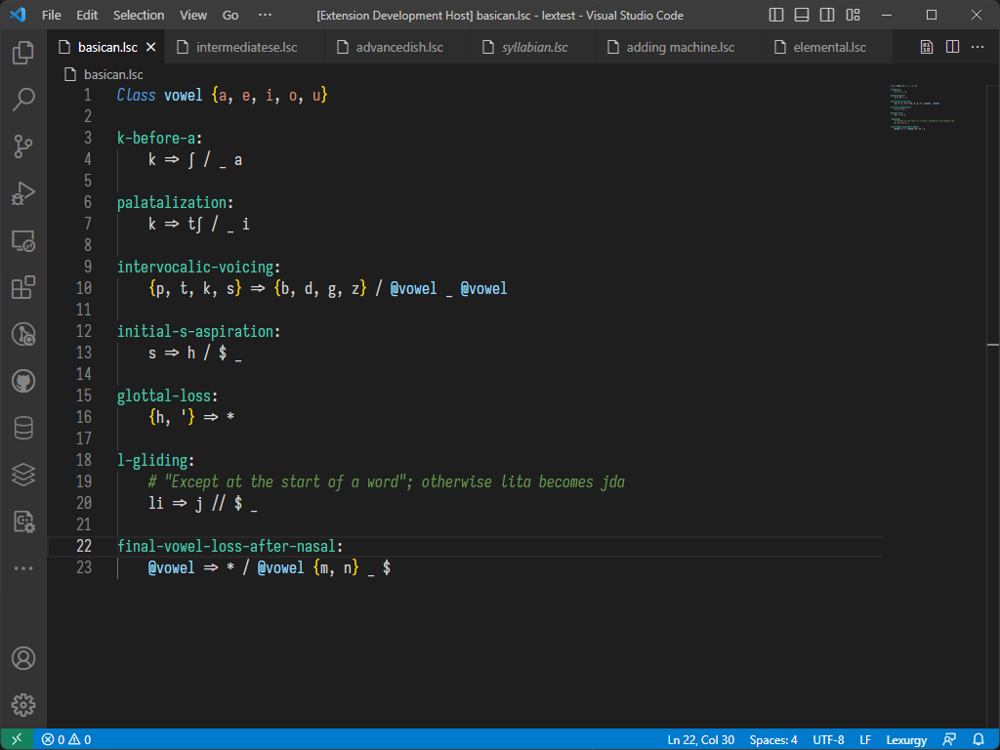
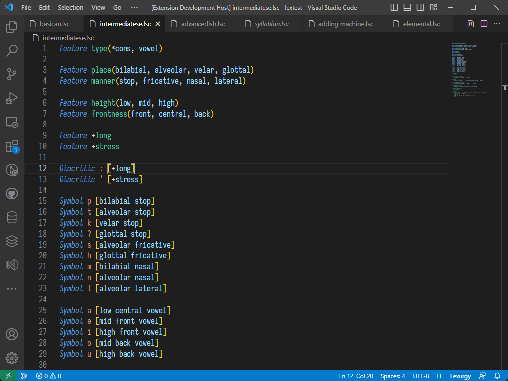
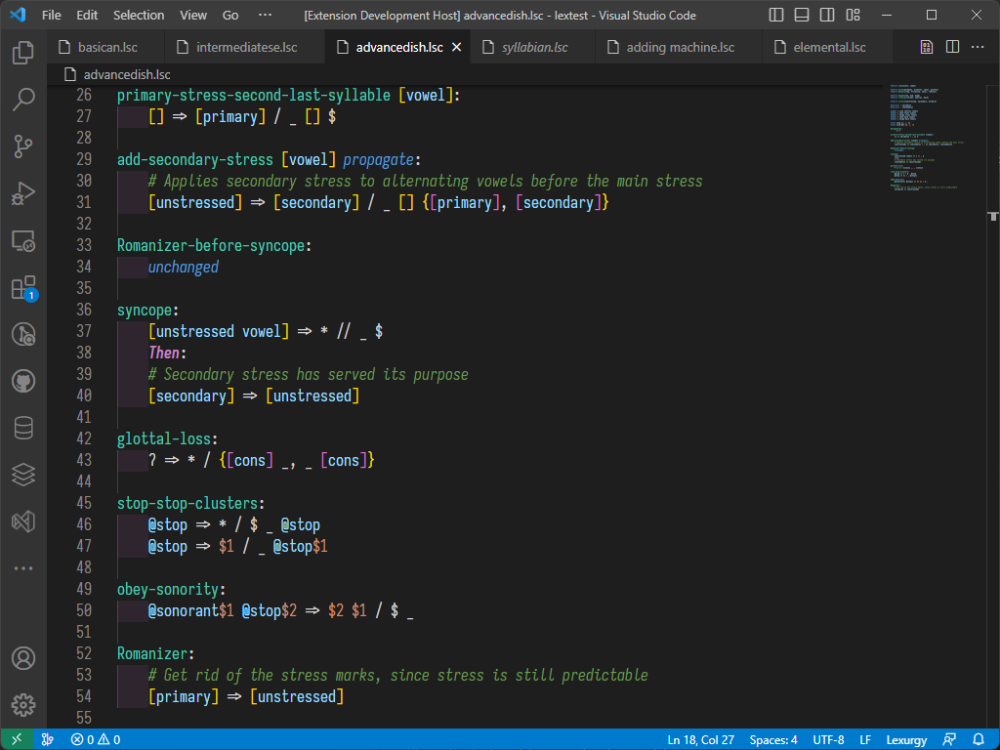
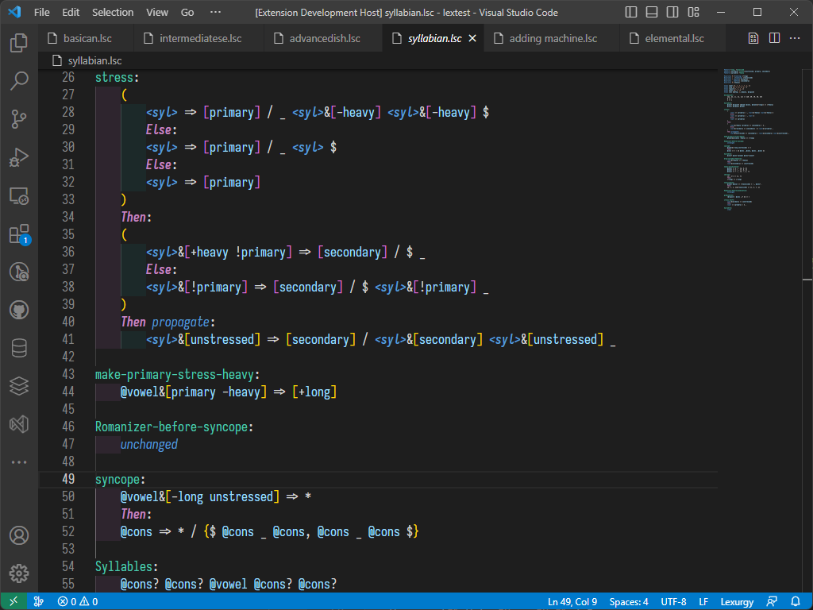
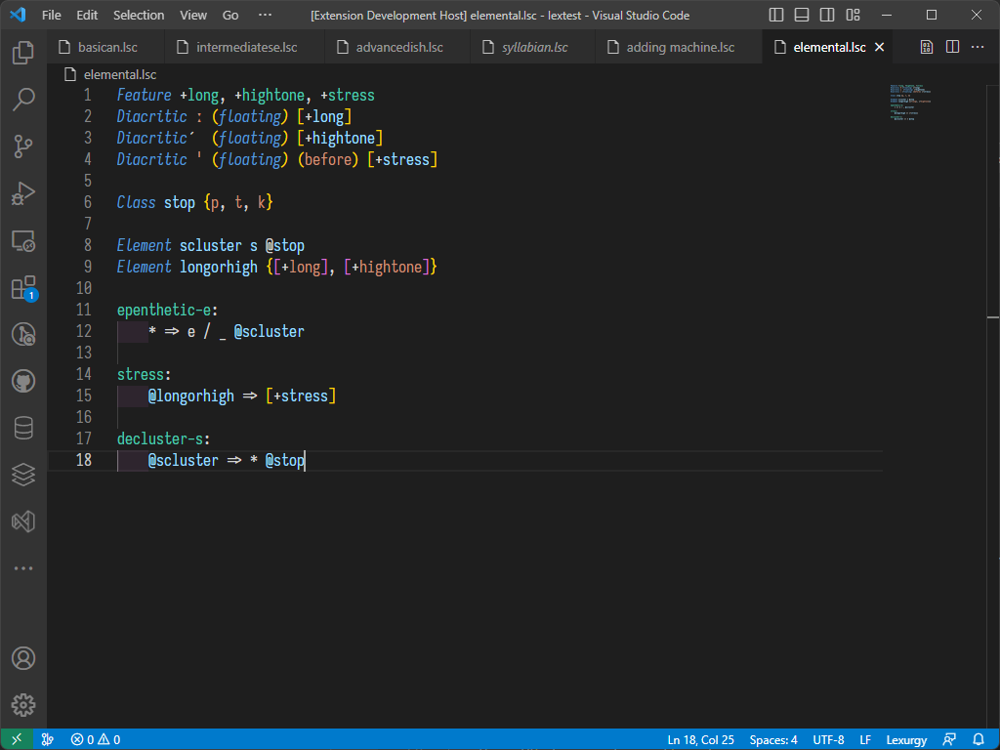

# Lexurgy Syntax Highlighting for VS Code

Basic syntax highlighting for the [Lexurgy Sound Changer](https://www.lexurgy.com/sc) for VS Code.

## Associated File Extensions

* `.lsc`

## Links

* [Lexurgy](https://www.lexurgy.com/sc)
* [Repository](https://github.com/bigyihsuan/lexurgy-syntax-highlighting)
* [Extension Store Page](https://marketplace.visualstudio.com/items?itemName=bigyihsuan9999.lexurgy-syntax-highlighting)

## Images

